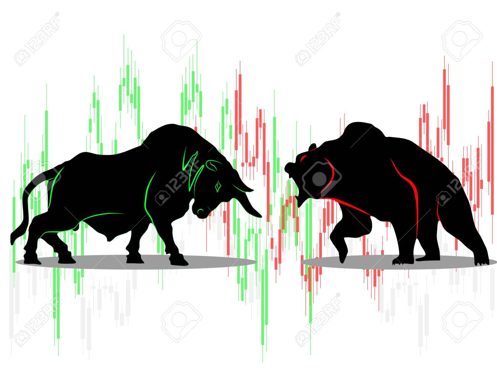

### Table of Contents
- [Stock-Market-Lookup-And-Prediction-system](#stock-market-lookup-and-prediction-system)
- [Functionality](#functionality)

## StockWatch - Stock Data Viewing Tool
 - This is software which provides data of stock in form of chart. This also provides live price of data. This software uses api from some website to take data. It also contain link of compnay's website.
 
* This project uses the [MERN stack] and Machine Learning :
  * [**M**ongoose.js](http://www.mongoosejs.com) ([MongoDB](https://www.mongodb.com)) : database
  * [**E**xpress.js](http://expressjs.com) : backend framework
  * [**R**eact](https://reactjs.org/) : frontend framework
  * [**N**ode.js](https://nodejs.org) : runtime environment
  * [streamlit][keras][Numpy and Pandas]

* Other tools and technologies used :
  * [Angular CLI](https://cli.angular.io) : frontend scaffolding
  * [Material UI](https://material-ui.com/) : layout and styles
  * [Alpaca](https://alpaca.markets/) : api for stock data
  * [Highchart](https://www.highcharts.com/) : chart for stock data

## Functionality
  - Register, Login / Logout, Contact Us
  - View Stock data by watchlist
  - Nice Chart for showing data
  - Comapny's Fundamental data
  - Trigger
    - When price of perticular stock go above or below some limit than user will receive mail 
  - Stock Related Prediction
  - Portfolio
     - user get the total value of profit or loss from invested amount
## System Running Screenshot

